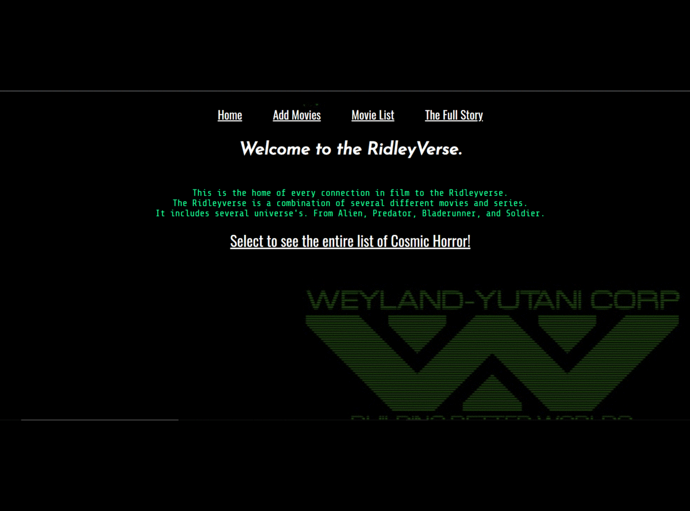

<!-- PROJECT LOGO -->

  

  <h3 align="center">Python Projects</h3>

  

    Tech Academy Python Course Repositiory.
  

<!-- TABLE OF CONTENTS -->

  
<h2 style="display: inline-block">Table of Contents</h2>

  <ul>
    <li><a href="#about-the-repository">About The Repository</a></li>
    <li><a href="#projects">Projects</a></li>
    <ul>
        <li><a href="#ridleyverse">RidleyVerse</a></li>
        <li><a href="#file-transfer-program">File Transfer Program</a></li>
        <li><a href="#phonebook">Phonebook</a></li>
        <li><a href="#checkbook">Checkbook</a></li>
        <li><a href="#nice-or-mean">Nice Or Mean</a></li>
        <li><a href="#student-tracker">Student Tracker</a></li>
      </ul>
    <li><a href="#built-with">Built With</a></li>
    <li><a href="#contact">Contact</a></li>
  </ul>

<!-- ABOUT THE repository -->
## About The repository

This repository serves as a record of all the files and projects completed during The Tech Academy's Python course. Below are programs and modules that iv used within the course. I have a beginning knowledge base to which I can expand and become more fluent. At this point in time I can get a set of instructions and then work on accomplishing them through research of anything I don't know how to do and incorporating what I do.

## Projects

### RidleyVerse
 The RidleyVers is a collection of movies that share a common universe. The program works as a website and uses html, CSS, Django, BeautifulSoup, and Python. Block tags are used to link each html file to create a whole site.
 The purpose is to create a master list of movies form the connected Ridleyverse. There is a form to enter the details of the movies such as film name, director, actors, plot. The movies are stored in a database. The Full Story button calls a BS function that pulls \<p\> tags from a list on IMDB, (link below). It then concentrates all of the text into a full block containing the entire story of the RidleyVerse as well as how each film is connected. I chose the Ridleyverse as my topic but this program could be applied to any number of film series. It could also be a master list of movies that could have a personal review section to store you persona opinion on the movie. It's like a media manager in a way.

### File Transfer Program
  This prohram allows the use to specify the directorys for a start point and destination. Then with a click the user can copy all files created or modified within 24 hours from   the start folder to the destination folder.
  
  
### Phonebook
  
### Checkbook
  
### Nice Or Mean
  
### Student Tracker
  

# Built With

* [Python3](https://www.python.org/downloads/)
* [Django](https://www.djangoproject.com/)
* [SQLite](https://www.sqlite.org/index.html)
* [mySQL](https://www.mysql.com/)
* [tkinter](https://docs.python.org/3/library/tkinter.html)
* [Virtual environments](https://docs.python.org/3/library/venv.html)
  
<!-- CONTACT -->
## Contact
 
Email: [watson0117@gmail.com](watson0117@gmail.com) 
Linkedin: [JoshWatson0117](www.linkedin.com/in/JoshWatson0117) 
Project Link: [https://github.com/Watson0117/Python_Projects](https://github.com/Watson0117/Python_Projects) 

